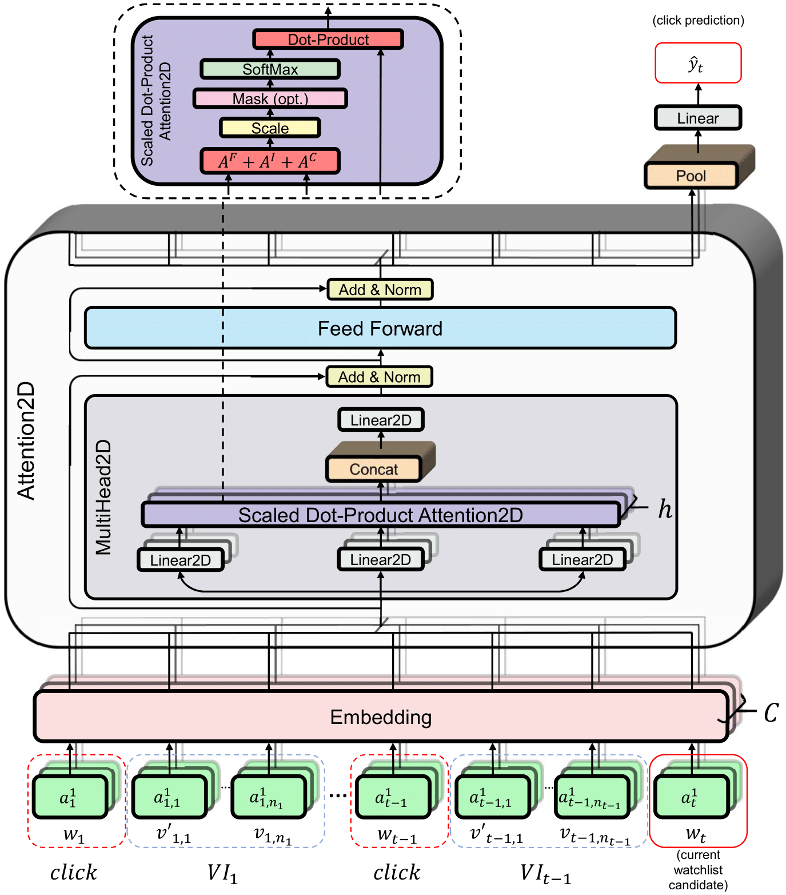

Trans2D: Sequential Modeling with Multiple Attributes for Watchlist Recommendation in E-Commerce
====

This repository provides a reference implementation of *Trans2D* as described in the paper:<br>
> Sequential Modeling with Multiple Attributes for Watchlist Recommendation in E-Commerce<br>
> Uriel Singer, Haggai Roitman, Yotam Eshel, Alexander Nus, Ido Guy, Or Levi, Idan Hasson and Eliyahu Kiperwasser.<br>
> International Conference on Web Search and Data Mining, 2022.<br>

The *Trans2D* algorithm allows to learn complex item-item, attribute-attribute and item-attribute patterns from sequential-data with multiple item attributes.



## Requirements
 - torch
 - pytorch_lightning
 - torchmetrics
 - transformers

## Citation

```
@inproceedings{wsdm2022-trans2d,
  title     = {Sequential Modeling with Multiple Attributes for Watchlist Recommendation in E-Commerce},
  author    = {Singer, Uriel and Roitman, Haggai and Eshel, Yotam and Nus, Alexander and Guy, Ido and Levi, Or and Hasson, Idan and Kiperwasser, Eliyahu},
  booktitle = {Proceedings of the 15th ACM International Conference on Web Search and Data Mining},
  year      = {2022},
  month     = {2},
}
```
